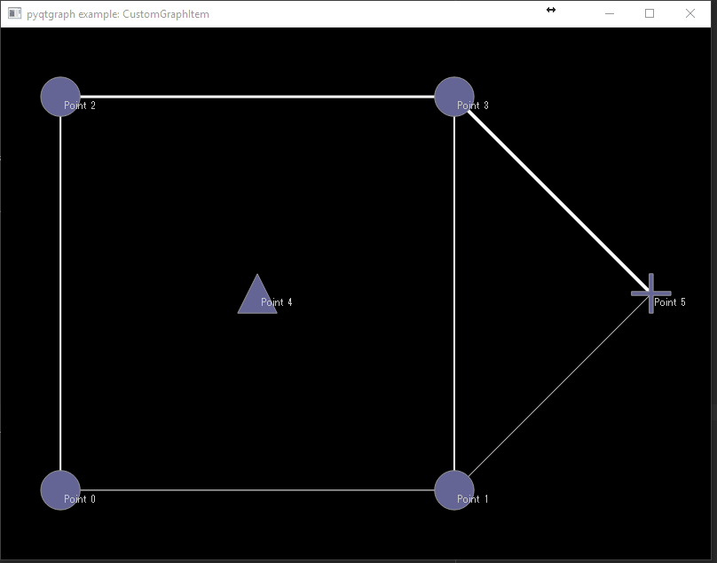

# Arc Flags

## Задание

- Вершины графа — точки на плоскости, дли́ны рёбер равны геометрическим длинам соответствующих отрезков.
- Ручной ввод графа с помощью графического интерфейса (добавление и
удаление вершин и рёбер с помощью мыши). Возможность сохранения в файл и
загрузки из файла.
- Однонаправленный и двунаправленный поиск.
- Подсветка цветом регионов и граничных вершин, возможность посмотреть
флаги для ребра при наведении мышки.
- В отчёте привести примеры выполнения алгоритма, иллюстрирующие
зависимость эффективности выполнения запросов от:
    - количества регионов;
    - использования однонаправленного или двунаправленного поиска.

## Видео об Алгоритме

https://www.youtube.com/watch?v=VVtqHjhEATI

## План написания программы

- ✅ Часть алгоритма
    1. ✅ Класс Графа, Вершин, Ребер
    2. ✅ Алгоритм Дейкстры - Однонаправленный поиск (Алгоритм Дейкстры запускается из одной вершины)
    3. ✅ Двунаправленный поиск ([Запускается из двух вершин](https://neerc.ifmo.ru/wiki/index.php?title=%D0%AD%D0%B2%D1%80%D0%B8%D1%81%D1%82%D0%B8%D0%BA%D0%B8_%D0%B4%D0%BB%D1%8F_%D0%BF%D0%BE%D0%B8%D1%81%D0%BA%D0%B0_%D0%BA%D1%80%D0%B0%D1%82%D1%87%D0%B0%D0%B9%D1%88%D0%B8%D1%85_%D0%BF%D1%83%D1%82%D0%B5%D0%B9#.D0.A3.D0.BB.D1.83.D1.87.D1.88.D0.B5.D0.BD.D0.B8.D1.8F_.D0.B0.D0.BB.D0.B3.D0.BE.D1.80.D0.B8.D1.82.D0.BC.D0.B0_.D0.94.D0.B5.D0.B9.D0.BA.D1.81.D1.82.D1.80.D1.8B))
    4. ✅ Оптимизация с помощью arc-flags
        1. ✅ Реализовать алгоритм Дейкстры наоборот (дерево кратчайших путей)
        2. ✅ Разбить все вершины на K регионов и пометить их
        3. ✅ Для каждого ребра присвоить флаг из K битов
        4. ✅ В коде программы выставить эти флаги (сделать предобработку к алгоритму)
        5. ✅ Добавить дополнительное условие в алгоритм Дейкстры
    5. ✅ Отладочная информация
- GUI часть (интерфейс)
    1. ✅ Реализация вершин разных цветов.
    2. ✅ Реализация направленности
    3. ✅ Добавление и удаление вершин и рёбер с помощью мыши
       * ✅ Добавить вершину: щелкнуть по пустому месту левой кнопкой мыши, выбрать "Добавить вершину", цвет "белый"
       * ✅ Добавить ребро: щелкнуть по вершине левой кнопкой мыши, выбрать "Добавить ребро", выбрать вторую вершину
       * ✅ Удалить вершину: щелкнуть по вершине левой кнопкой мыши, выбрать "Удалить вершину"
       * ✅ Удалить ребро: щелкнуть по ребру левой кнопкой мыши, выбрать "Удалить ребро"
    4. ✅ Возможность сохранения в файл и выгрузки.
    5. Запуск алгоритма однонаправленного и двунаправленного поиска
       * Меню "Run"
         * Unidirectional
         * Bidirectional
         * Выберите точку начала, выберите точку конца
         * Подсвечивает найденный путь зеленым 
         * Показывает скорость выполнения (в отдельном окне)
         * Сброс подсветки если нажимаешь на поле
    6. ✅ Покраска цветом региона
       * ✅ Покрасить вершину: щелкнуть по вершине левой кнопкой мыши, выбрать "Покрасить вершину", выбрать цвет из существующих
    7. Возможность просмотреть флаги для ребра
       * Щелкнуть по ребру левой кнопкой мыши, выбрать "Посмотреть флаги", открывается отдельное окно, где показывается 8 квадратов для каждого цвета вершин

## FIXME
Баги, которые нужно исправить:
...

## Библиотеки
 - для хранения данных (координаты, цвета)
 - библиотека для отображения графа в PyQT
 - библиотека для написания кроссплатформенной десктопных приложений

https://github.com/pydot/pydot

https://networkx.org/documentation/latest/tutorial.html

## Куски кода

https://stackoverflow.com/questions/46868432/pyqtgraph-change-color-of-node-and-its-edges-on-click